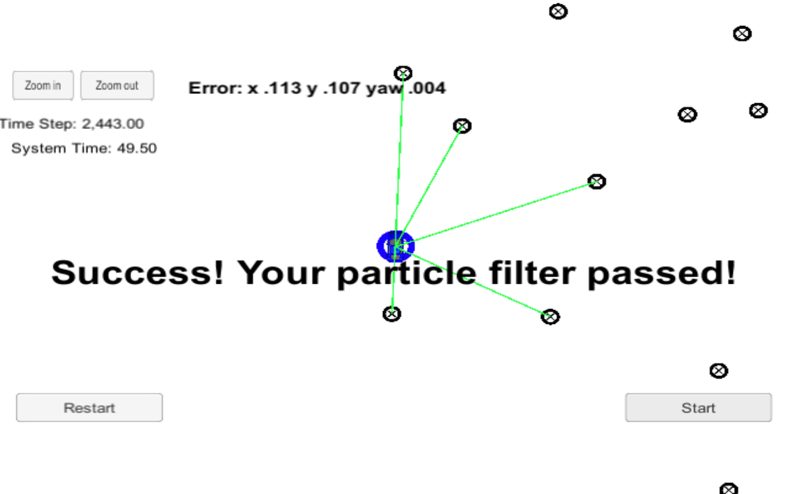

# Kidnapped Vehicle Project

 Robot has been kidnapped and transported to a new location! Luckily it has a map of this location, a (noisy) GPS estimate of its initial location, and lots of (noisy) sensor and control data.

In this project we will implement a 2 dimensional particle filter in C++. Particle filter will be given a map and some initial localization information (analogous to what a GPS would provide). At each time step filter will also get observation and control data.


The project is to build out the methods in `particle_filter.cpp` and simulator output says:

```
Success! Your particle filter passed!
```

Here is the screenshot for final output:



